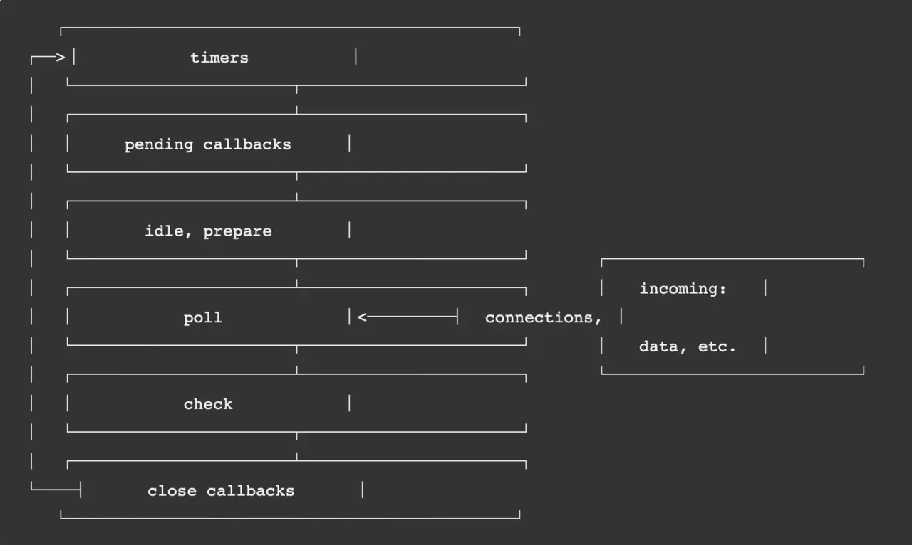

---

title: node的eventLoop

meta:
  - name: description
    content: node的eventLoop

created: 2021/02/20

updated: 2021/02/20
 
---

## 前言
面试的时候js的事件循环经常会被问到，之前我也了解过浏览器的事件循环，但是显然作为回答还是不够完美，现在写一下node的事件循环，发现node的事件循环还是相对于浏览器有点复杂的,可以找一些关于异步io模型的文章阅读。

## node的执行环境
`经常有人问node是单线程的吗?`
*答：js执行的主线程是单线程，但是一些异步的任务如io，网络请求交给libuv等库执行可多线程，线程池默认大小为4，可用process.env.UV_THREADPOOL_SIZE更改*

## node eventLoop阶段

- timers：执行setTimeout() 和 setInterval()中到期的callback。
- pending callbacks：上一轮循环中一些和底层系统有关的操作callback会被延迟到这一轮的这一阶段执行
- idle, prepare：仅内部使用，存放了process.nextTick队列
- poll：最为重要的阶段，执行I/O callback，在适当的条件下会阻塞在这个阶段
- check：执行setImmediate的callback
- close callbacks：执行close事件的callback，例如socket.on("close",func)

*这些阶段执行完为一tick*

## 重点

setTimeout(callback,0)
会被转换成setTimeout(callback,1)。并且定时器的执行并不会完全准确，当他的delay时间到了，调度系统只能尽可能快的去执行他
