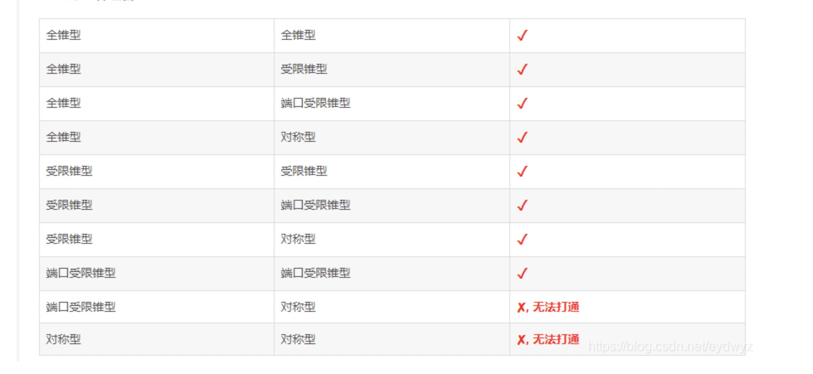

---

title: p2p详解

meta:
  - name: description
    content: p2p详解
  - name: keywords
    content: p2p, webrtc

created: 2021/11/07

updated: 2021/11/07
 
tags:
  - p2p, webrtc
---

---

## NAT(Network Address translator)
### NAT诞生原因
  - ipV4地址不足
  - 内网统一出口，更加安全

### NAT类型
  - 完全锥形（Full Cone NAT）
  - 地址限制型锥形（Address Restricted Cone NAT）对对外请求的地址进行记录，只有请求过的地址(不同端口都可以)才可以回消息
  - 端口限制锥形（Port Restricted Cone NAT）(相对地址限制，增加了端口限制，比如请求只有22.22.22.22:80那么只有22.22.22.22:80的端口才可以回复消息)
  - 对称型NAT(Symmetric NAT)（最严格，假如请求百度的:80端口出去的是携带的ip和端口号会单独映射生成其他的ip和端口，请求qq:443端口也会生成另一个映射ip和端口，解决的问题是，无法在外部查看内部真实的地址）

### NAT打洞组合
 

### NAT穿越原理
- A,B主机分别向STUN发送消息，STUN获取了A,B的公网出口地址
- STUN帮助交换A，B公网Ip端口
### NAT类型判断

## STUN(simple traversal of udp through NAT)

## TURN (Traversal using relays around NAT)

当STUN失败时由公网主机转发

## ICE 是上面两种服务的组合

[参考](https://www.cnblogs.com/my_life/articles/1908552.html)