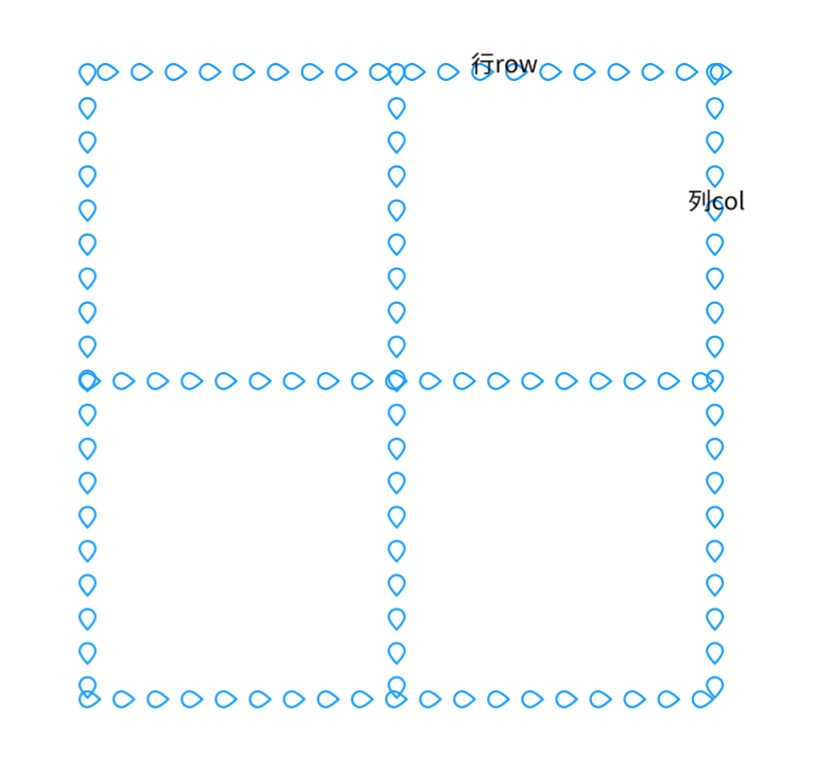
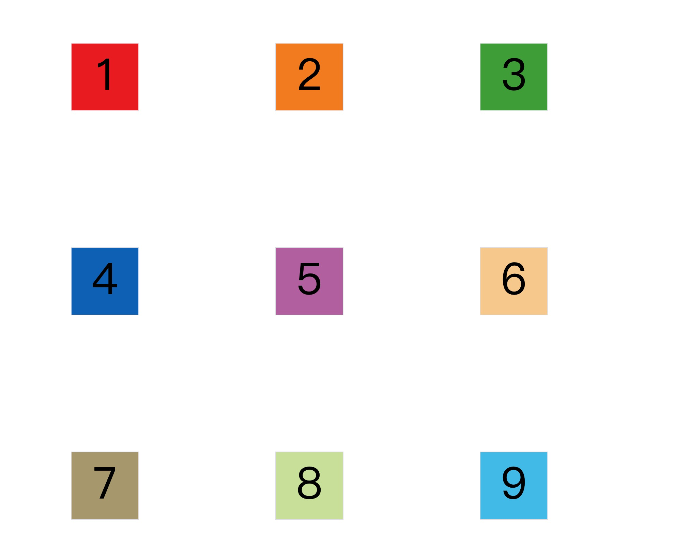
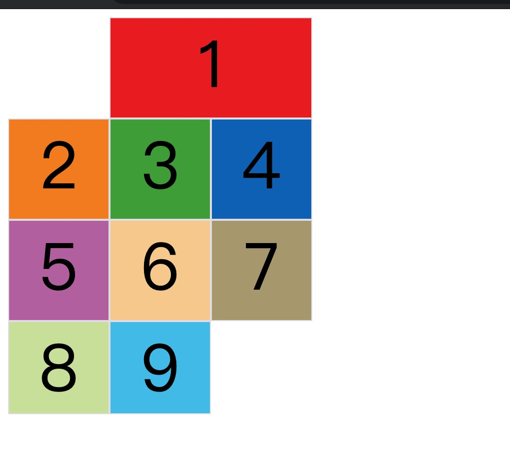

---

title: 写给自己看的Grid布局

meta:
  - name: description
    content: 写给自己看的Grid布局
  - name: keywords
    content: Typescript

created: 2020/11/27

updated: 2020/11/27
---

---

# 前言
平常开发中我们通常用flex或者float position布局，随着grid布局的兼容性越来越好，我们很有必要深入研究一下grid布局。

# 概念
 


首先我们要了解grid布局的基本概念，行和列，如图所示。
这是一个2（行）X2（列）的单元格网格线3X3。

# 属性

属性分为两类，容器属性和项目属性

## 容器属性
[demo](https://stackblitz.com/edit/blog-grid?file=1.html)
```
display: grid;// inline-grid
//设为网格布局以后，容器子元素（项目）的float、display: inline-block、display: table-cell、vertical-align和column-*等设置都将失效。
// 从demo里看我们顶一个3X3的九宫格很方便，但是假如我要定义个10X10的时候，岂不是很麻烦。
这个时候可以用repeat函数
grid-template-columns: repeat(3, 50px);
//第一个参数是重复次数，第二个参数是模式，不仅仅可以写50px 还可以写grid-template-columns: repeat(3, 50px 20px 30px);相当于把第二个参数重复三遍
第一个参数可以是auto-fill假如我们不知道容器宽度，自然不知道第一个参数是什么那么可以使用自动填充
grid-template-columns: 1fr 2fr
//定义宽度，表示第二个是第一个宽度两倍
//此外还可以接受minmax(from,to)表示大小在这范围之中
// 命名网格线
grid-template-columns: [c1] 1fr [c2] 1fr [c3];
grid-template-rows: [r1] 1fr [r2] 1fr [r3];
grid-row-gap: 20px; //行间距
grid-column-gap: 20px; //列间距
grid-auto-flow:row //row默认值 column可选 
grid-auto-flow:row dense //dense效果尽可能填满
```

单元格的内容定位
```
justify-items: start | end | center |stretch; //单元格内容的水平位置
align-items: start | end | center | stretch;// 设置单元格内容的垂直位置
```
容器定位
容器可以相对他的父级进行定位
```
justify-content: start | end | center | stretch | space-around | space-between | space-evenly;
align-content: start | end | center | stretch | space-around | space-between | space-evenly;
```


我设置成这样代码

```

#container {
        display: grid;
        grid-template-columns: 100px 100px 100px;
        grid-template-rows: 100px 100px 100px;
        justify-content:space-around;
        align-content:space-around;
        height: 900px;
      }
```
- space-evenly - 项目与项目的间隔相等，项目与容器边框之间也是同样长度的间隔。
- space-around - 每个项目两侧的间隔相等。所以，项目之间的间隔比项目与容器边框的间隔大一倍。

假如我们把网格设置成3X3但是配置单元格内容在5X5的位置，那么可以配置grid-auto-columns属性和grid-auto-rows可以设置多余出来的宽度和高度
## 项目属性
> - grid-column-start属性：左边框所在的垂直网格线
> - grid-column-end属性：右边框所在的垂直网格线
> - grid-row-start属性：上边框所在的水平网格线
> - grid-row-end属性：下边框所在的水平网格线 
```
.item-1 {
  grid-column-start: 2;
  grid-column-end: 4;
}
```


还记得刚才我们命名网格线了吗？这边的参数可以用网格线的名字，如果项目产生重叠，可以用z-index来命名；
> - justify-self 属性，
> - align-self 属性
之前介绍`justify-items` `align-items`的区别就是，*-items作用于所有，
*-self作用于自身