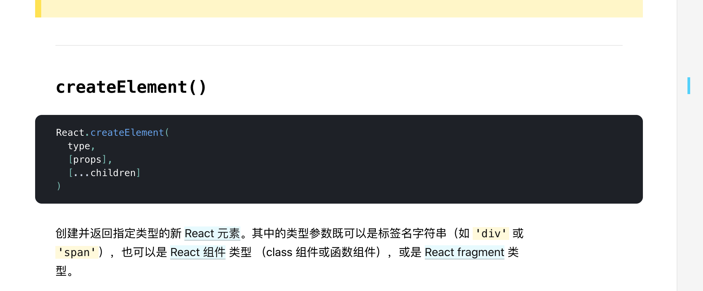

---

title: react源码阅读之React.createElement

meta:
  - name: description
    content: react源码阅读
  - name: keywords
    content: react源码阅读

created: 2020/11/21

updated: 2020/11/21
 
tags:
    - react源码阅读
---

---
## React.createElement用法
    jsx->js会调用这个方法，参数直接放官网的图

##     
代码在[ReactElement.js](https://github.com/facebook/react/blob/v16.13.1/packages/react/src/ReactElement.js)现在我们开始解读吧
```
export function createElement(type, config, children) {
  let propName;
  const props = {};
  let key = null;
  let ref = null;
  let self = null;
  let source = null;
  if (config != null) {
    if (hasValidRef(config)) {
      ref = config.ref;
      if (__DEV__) {
        //Ref现在string老版本的创建方式会warning
        warnIfStringRefCannotBeAutoConverted(config);
      }
    }
    if (hasValidKey(config)) {
      key = '' + config.key;
    }

    self = config.__self === undefined ? null : config.__self;
    source = config.__source === undefined ? null : config.__source;
    // Remaining properties are added to a new props object
    for (propName in config) {
      if (
        hasOwnProperty.call(config, propName) &&
        !RESERVED_PROPS.hasOwnProperty(propName)
      ) {
        //如果config中的属性不是标签原生属性，则放入props对象中
        props[propName] = config[propName];
      }
    }
  }
  //获取children的长度，不明白为啥不用es6的方法，而是用这个来判断
   const childrenLength = arguments.length - 2;
  if (childrenLength === 1) {
    props.children = children;
  } else if (childrenLength > 1) {
    const childArray = Array(childrenLength);
    for (let i = 0; i < childrenLength; i++) {
      childArray[i] = arguments[i + 2];
    }
    if (__DEV__) {
      if (Object.freeze) {
        Object.freeze(childArray);
      }
    }
    props.children = childArray;
  }

  // Resolve default props
  if (type && type.defaultProps) {
    const defaultProps = type.defaultProps;
    for (propName in defaultProps) {
      //prop没有设置值，则为默认值
      if (props[propName] === undefined) {
        props[propName] = defaultProps[propName];
      }
    }
  }
  if (__DEV__) {
    if (key || ref) {
      const displayName =
        typeof type === 'function'
          ? type.displayName || type.name || 'Unknown'
          : type;
      if (key) {
        defineKeyPropWarningGetter(props, displayName);
      }
      if (ref) {
        defineRefPropWarningGetter(props, displayName);
      }
    }
  }
  return ReactElement(
    type,
    key,
    ref,
    self,
    source,
    ReactCurrentOwner.current,// null || fiber
    props,
  );
}

```

## ReactElement方法
这是一个工厂方法，根据你传来的属性来创造一个element对象
```
const ReactElement = function(type, key, ref, self, source, owner, props) {
  const element = {
    // This tag allows us to uniquely identify this as a React Element
    $$typeof: REACT_ELEMENT_TYPE,//element类型 如provider ，element，portal
    type: type,
    key: key,
    ref: ref,
    props: props,
    _owner: owner, //记录创建组件的模式fiber
  };

  if (__DEV__) {
    //经典面试题之实现一个const效果，除了defineProperty，还有frozen，seal,有兴趣可以看一下mdn文档 frozen的效果是最好的 这边是为了在dev下让这些属性不可被篡改
    element._store = {};
    Object.defineProperty(element._store, 'validated', {
      configurable: false,
      enumerable: false,
      writable: true,
      value: false,
    });
    Object.defineProperty(element, '_self', {
      configurable: false,
      enumerable: false,
      writable: false,
      value: self,
    });
    Object.defineProperty(element, '_source', {
      configurable: false,
      enumerable: false,
      writable: false,
      value: source,
    });
    if (Object.freeze) {
      Object.freeze(element.props);
      Object.freeze(element);
    }
  }

  return element;
};
```
## $$typeof
 这边有一个`$$typeof`这个属性，发现他的值是一个枚举，当我们点进去发现开头用的16进制来表示，当发现支持symbol的情况下我们看到了很多熟悉的字符串，react.provider,react.context,为啥要定义 $$typeof?先贴一下别人的文章，我也在这边简单的概括一下[文章地址](https://zhuanlan.zhihu.com/p/53163790)
 ```
export default function App() {
  let text = '';
  return (
    <div>
      <h1>Hello StackBlitz!</h1>
      <p>{text}</p>
      <p dangerouslySetInnerHTML={{ __html: text }} />
    </div>
  );
}

在第一次使用text的定法打印的是字符串，第二处error报错了我们没设置src，onerror处是一个方法,这显然xss攻击有机可乘，假如接收一个element对象的json但是没有$$typeof，所以用symbol来标记$$typeof 这显然提高了安全性，将普通对象和element对象区分开，react只处理自己创建的element元素。
 ```