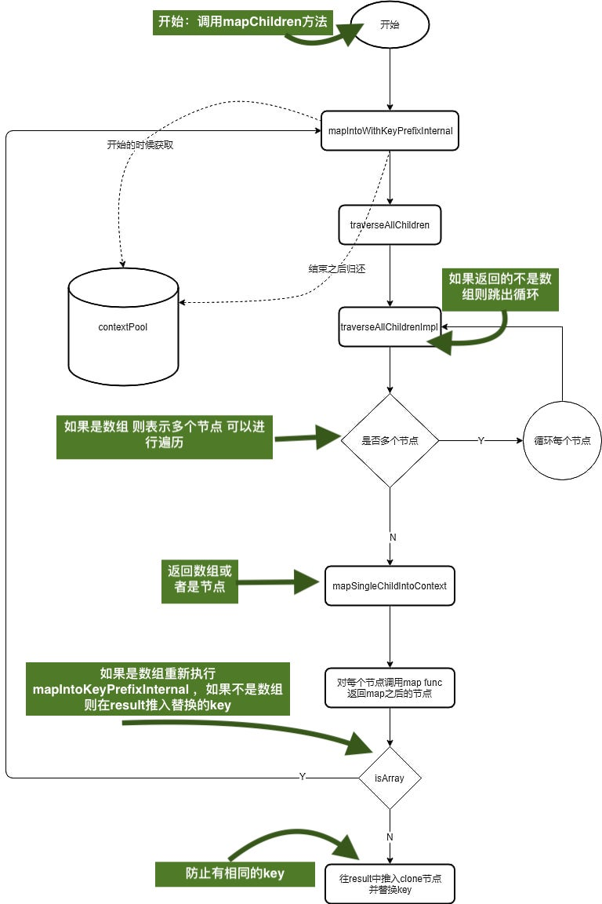

---

title: react源码阅读之react.Children.md

meta:
  - name: description
    content: react源码阅读
  - name: keywords
    content: react源码阅读

created: 2020/11/21

updated: 2020/11/21
 
tags:
    - react源码阅读
---

---

# 前言
React里props默认属性children，是指父组件里的children
```
<Father>
    <child1/>
    <child2/>
</Father>
里面的两个就是children
```
有一写很经典的面试题，比如你document.getElementByClassName();获取的值是Array like对象，他有`length`属性,可以for循环，但是没有部署迭代器，不可以使用Array原型链上的方法，我们可以通过一些方法将他们转成Array，说这些就有点扯远了，react的children也是Array like。[源码地址](https://github.com/facebook/react/blob/v16.13.1/packages/react/src/ReactChildren.js)
```
const SEPARATOR = '.';
const SUBSEPARATOR = ':';

function escape(key) {
  const escapeRegex = /[=:]/g;
  const escaperLookup = {
    '=': '=0',
    ':': '=2',
  };
  const escapedString = ('' + key).replace(escapeRegex, function(match) {
    return escaperLookup[match];
  });

  return '$' + escapedString;
}

let didWarnAboutMaps = false;

const userProvidedKeyEscapeRegex = /\/+/g;
function escapeUserProvidedKey(text) {
    //如果key里有多个/则结尾添加/
  return ('' + text).replace(userProvidedKeyEscapeRegex, '$&/');
}

const POOL_SIZE = 10;//对象池最大容量
const traverseContextPool = [];
//创建对象池，减少反复创建对象
function getPooledTraverseContext(
  mapResult,
  keyPrefix,
  mapFunction,
  mapContext,
) {
    如果对象池有对象，则出队
  if (traverseContextPool.length) {
    const traverseContext = traverseContextPool.pop();
    traverseContext.result = mapResult;
    traverseContext.keyPrefix = keyPrefix;
    traverseContext.func = mapFunction;
    traverseContext.context = mapContext;
    traverseContext.count = 0;
    return traverseContext;
  } else {
    return {
      result: mapResult,
      keyPrefix: keyPrefix,
      func: mapFunction,
      context: mapContext,
      count: 0,
    };
  }
}
//将traverseContext上的属性重置放回到对象池里
function releaseTraverseContext(traverseContext) {
  traverseContext.result = null;
  traverseContext.keyPrefix = null;
  traverseContext.func = null;
  traverseContext.context = null;
  traverseContext.count = 0;
  if (traverseContextPool.length < POOL_SIZE) {
    traverseContextPool.push(traverseContext);
  }
}

//递归 目的为了展平数组
//如果遇到数组那么久反复自身调用，最终遇到节点调用callback
function traverseAllChildrenImpl(
  children,
  nameSoFar,
  callback,
  traverseContext,
) {
  const type = typeof children;

  if (type === 'undefined' || type === 'boolean') {
    // All of the above are perceived as null.
    children = null;
  }
    //调用callback flag
  let invokeCallback = false;

  if (children === null) {
    invokeCallback = true;
  } else {
    switch (type) {
      case 'string':
      case 'number':
        invokeCallback = true;
        break;
      case 'object':
        switch (children.$$typeof) {
            //这些都是合理的react渲染节点
          case REACT_ELEMENT_TYPE:
          case REACT_PORTAL_TYPE:
            invokeCallback = true;
        }
    }
  }

  if (invokeCallback) {
    callback(
      traverseContext,
      children,
      //如果只有一个节点调用callback
      nameSoFar === '' ? SEPARATOR + getComponentKey(children, 0) : nameSoFar,
    );
    return 1;
  }

  let child;
  let nextName;
  let subtreeCount = 0; // 当前有多少个chidren在此节点
  const nextNamePrefix =
    nameSoFar === '' ? SEPARATOR : nameSoFar + SUBSEPARATOR;
//如果还是数组，则继续递归
  if (Array.isArray(children)) {
    for (let i = 0; i < children.length; i++) {
      child = children[i];
      nextName = nextNamePrefix + getComponentKey(child, i);
      subtreeCount += traverseAllChildrenImpl(
        child,
        nextName,
        callback,
        traverseContext,
      );
    }
  } else {
    const iteratorFn = getIteratorFn(children);
    if (typeof iteratorFn === 'function') {
      if (disableMapsAsChildren) {
        invariant(
          iteratorFn !== children.entries,
          'Maps are not valid as a React child (found: %s). Consider converting ' +
            'children to an array of keyed ReactElements instead.',
          children,
        );
      }

      if (__DEV__) {
        // Warn about using Maps as children
        if (iteratorFn === children.entries) {
          if (!didWarnAboutMaps) {
            console.warn(
              'Using Maps as children is deprecated and will be removed in ' +
                'a future major release. Consider converting children to ' +
                'an array of keyed ReactElements instead.',
            );
          }
          didWarnAboutMaps = true;
        }
      }
        //不是array、但是也不是最终渲染的子节点,部署迭代器遍历
      const iterator = iteratorFn.call(children);
      let step;
      let ii = 0;
      while (!(step = iterator.next()).done) {
        child = step.value;
        nextName = nextNamePrefix + getComponentKey(child, ii++);
        subtreeCount += traverseAllChildrenImpl(
          child,
          nextName,
          callback,
          traverseContext,
        );
      }
    } else if (type === 'object') {
      let addendum = '';
      if (__DEV__) {
        addendum =
          ' If you meant to render a collection of children, use an array ' +
          'instead.' +
          ReactDebugCurrentFrame.getStackAddendum();
      }
      const childrenString = '' + children;
      invariant(
        false,
        'Objects are not valid as a React child (found: %s).%s',
        childrenString === '[object Object]'
          ? 'object with keys {' + Object.keys(children).join(', ') + '}'
          : childrenString,
        addendum,
      );
    }
  }

  return subtreeCount;
}

function traverseAllChildren(children, callback, traverseContext) {
  if (children == null) {
    return 0;
  }

  return traverseAllChildrenImpl(children, '', callback, traverseContext);
}

function getComponentKey(component, index) {
  // Do some typechecking here since we call this blindly. We want to ensure
  // that we don't block potential future ES APIs.
  if (
    typeof component === 'object' &&
    component !== null &&
    component.key != null
  ) {
    // 如果有key返回处理过后的
    return escape(component.key);
  }
  // Implicit key determined by the index in the set
  //返回36进制string
  return index.toString(36);
}

function forEachSingleChild(bookKeeping, child, name) {
  const {func, context} = bookKeeping;
  func.call(context, child, bookKeeping.count++);
}

function forEachChildren(children, forEachFunc, forEachContext) {
  if (children == null) {
    return children;
  }
  const traverseContext = getPooledTraverseContext(
    null,
    null,
    forEachFunc,
    forEachContext,
  );
  traverseAllChildren(children, forEachSingleChild, traverseContext);
  releaseTraverseContext(traverseContext);
}
//复制除了key以外的属性 替换key属性 将其放到result中 bookKeeping:context对象
function mapSingleChildIntoContext(bookKeeping, child, childKey) {
  const {result, keyPrefix, func, context} = bookKeeping;

  let mappedChild = func.call(context, child, bookKeeping.count++);
  if (Array.isArray(mappedChild)) {
    mapIntoWithKeyPrefixInternal(mappedChild, result, childKey, c => c);
  } else if (mappedChild != null) {
    if (isValidElement(mappedChild)) {//不是数组改变key保留之前其他的属性，push进result
      mappedChild = cloneAndReplaceKey( //ReactElement.js里的方法
        mappedChild,
        // Keep both the (mapped) and old keys if they differ, just as
        // traverseAllChildren used to do for objects as children
        keyPrefix +
          (mappedChild.key && (!child || child.key !== mappedChild.key)
            ? escapeUserProvidedKey(mappedChild.key) + '/'
            : '') +
          childKey,
      );
    }
    result.push(mappedChild);
  }
}

function mapIntoWithKeyPrefixInternal(children, array, prefix, func, context) {
  let escapedPrefix = '';
  if (prefix != null) {
    escapedPrefix = escapeUserProvidedKey(prefix) + '/';
  }
  const traverseContext = getPooledTraverseContext(
    array,
    escapedPrefix,
    func,
    context,
  );
  //展平数组
  traverseAllChildren(children, mapSingleChildIntoContext, traverseContext);
  releaseTraverseContext(traverseContext);
}
function mapChildren(children, func, context) {
  if (children == null) {
    return children;
  }
  const result = [];
  mapIntoWithKeyPrefixInternal(children, result, null, func, context);
  return result;
}

function toArray(children) {
  const result = [];
  mapIntoWithKeyPrefixInternal(children, result, null, child => child);
  return result;
}

function onlyChild(children) {
  invariant(
    isValidElement(children),
    'React.Children.only expected to receive a single React element child.',
  );
  return children;
}

export {
  forEachChildren as forEach,
  mapChildren as map,
  countChildren as count,
  onlyChild as only,
  toArray,
};

```

[图片来源](https://www.cnblogs.com/sunxiaopei/p/12335941.html)